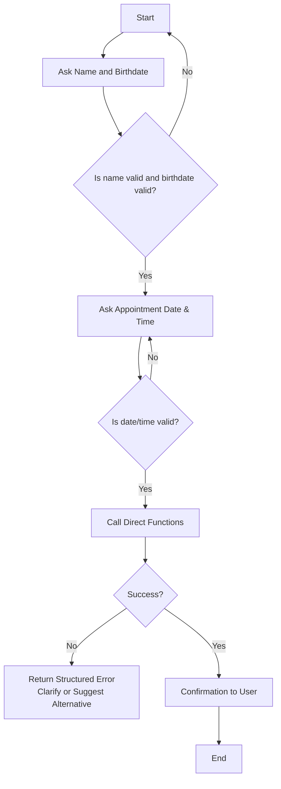

# Table of Contents

- [Table of Contents](#table-of-contents)
- [Project Structure (summary)](#project-structure-summary)
- [1. Overview](#1-overview)
- [2. Conversation Flow](#2-conversation-flow)
- [3. Installation](#3-installation)
- [4. Healthie Integration](#4-healthie-integration)
  - [Adapters](#adapters)
  - [Live Healthie Tests](#live-healthie-tests)
  - [5.Potential Improvements](#5potential-improvements)
- [6. Future Considerations](#6-future-considerations)

#  Project Structure (summary)

- `/integration`: Playwright flows that interact with Healthie’s web UI.
- `/adapters/pipecat`: Glue code that exposes the integration functions to the Pipecat bot.
- `/utils`: Shared helpers such as `get_verification_code` and `date_helpers`.
- `/tests`: PyTest suites (including `test_healthie_live.py`) that drive live integrations.
- `/docs`: Documentation artifacts describing the conversation flow and testing commands.

# 1. Overview

The agent first asks the user for a name and birthdate through a dialog. Once those details are available, it searches for an existing patient. If the patient is found, the agent offers to create an appointment. When the user confirms, the bot asks for a date and time and then schedules the appointment with the gathered information.

# 2. Conversation Flow

- **Question order**: name → birthdate → appointment date and time.
- **Error handling**: If any step returns incomplete or missing data, the bot repeats the question or requests clarification before advancing.
- **Function calling**: We chose direct functions rather than Pipecat function calling for this flow. It keeps the logic in one place while we iterate rapidly on the pipeline.



# 3. Installation

At the beginning, I ran into installation issues. I was unable to install the Python libraries because not all of them were compatible with Windows.

I then tried using the Docker setup you provided, but it also failed, as I continued encountering Windows related issues. After that, I attempted to use Docker with a Linux configuration. Although the installation completed successfully, the application did not run correctly.

Finally, I switched to WSL, and that approach worked without issues.

# 4. Healthie Integration

I began by using the browser inspector to identify the HTML elements Playwright needed to interact with. Prompting an LLM helped clarify how to call those elements. Later I discovered `playwright codegen https://secure.gethealthie.com`, which records actions in a browser session and shows the corresponding Playwright commands, significantly speeding up development.

1. `login_to_healthie` already existed in the base repository, so I tried to modify it as little as possible.
Healthie updated the login flow on 2026-02-18, sending a verification code to Gmail. To handle this, I added a `get_otp function` in `utils/get_verification_code` to read the code from Gmail.
They updated the flow again on 2026-02-20, removing the verification code step, but I still adjusted the login routine from the original UI version to accommodate the changes.

2. For `find_patient`, I chose to search within the Clients section rather than the main search bar because the results there listed matching users and counts more clearly. That makes it easier to detect when no matches are found or when clarification is needed. I also capture slightly more user's details than strictly necessary in case the function is reused in other scenarios.

3. `create_appointment` uses default values when possible to keep the flow simple. When multiple consultancy options exist, I picked one and left room to make that choice dynamic in a future improvement. Date handling helpers include:

   -  `convert_to_date_time(str_value)` is used to create a `datetime` object from a string, making it easier to manipulate dates and times programmatically.

   - `format_target_date(date_str, time_str)` formats the date and time strings so that they match the calendar selector in the UI. 
   - `format_appointment_label(datetime_value)` adapts the `datetime` object to the UI’s label format. This formatted label is then used to find the appointment in the list


After creating an appointment, the client section is inspected to verify that the appointment was created and extract the meeting link (and other fields if needed).

## Adapters

I created an adapter so the bot can call the integration functions directly. I preferred direct functions to the Standard Function Schema because they were faster to adjust while iterating, particularly when tweaking descriptions or formats. The adapters currently wrap `None` returns, but they would benefit from richer error information to surface more helpful messages to the user.

## Live Healthie Tests

Run the live Healthie test suite with:

```bash
uv run python -m pytest -s -vv -m live tests/test_healthie_live.py::test_create_appointment_success -o log_cli=true -o log_cli_level=INF
```
The `live` marker ensures these tests run only when explicitly requested. They require real Healthie credentials, so make sure to populate `HEALTHIE_EMAIL` and `HEALTHIE_PASSWORD` in your local `.env` file (never commit this file with secrets). The tests will automatically skip if the variables are missing and fail fast if the account cannot authenticate. These tests act as short sanity checks to confirm that the real web experience still works. Note that some tests may pass once but fail on subsequent runs unless you clean up previously created state—for example, creating the same appointment twice will fail because Healthie disallows duplicate dates.

While unit tests could be added with mocks, they risk passing even when the real UI changes. Helpers such as `utils/get_verification_code.py` are better candidates for isolated testing. In general, utility functions are the most valuable targets for unit coverage. This is why integration tests have been created for the flows that involve real interactions.

## 5.Potential Improvements

- **Latency**: A hypothetical Healthie API would reduce latency (though that is outside our control). Consolidating `find_patient` and `create_appointment` into a single login sequence could eliminate redundant steps or even unify the two flows when reusability is less critical. Playwright selectors could be optimized for speed, and shorter prompts could speed up the bot conversation. A faster bot voice might also improve the perceived responsiveness.
- **Reliability**: Add retry logic or adopt a `Result<Ok, Error>` pattern (see https://pypi.org/project/result/) so each integration function returns a structured error rather than `None`. Knowing the error type allows the bot to decide the next action (e.g., re-ask for missing fields or suggest alternative slots). Apply this pattern to `integration/healthie.py` for both `find_patient` and `create_appointment`, and propagate the richer errors through `adapters/pipecat/healthie.py` so the bot can explain issues such as occupied slots. Including a simplified real-world example in the docs would help illustrate how this flow behaves. Additionally, integrate Playwright with more robust selectors and reusable helper functions for both patient search and appointment creation flows to reduce test flakiness and improve end to end stability.
- **Evaluation**: The prompt already asks users to verify data before creating an appointment, which reduces input errors. `create_appointment` confirms that the appointment was created and returns `None` when it fails. Healthie also sends emails, so we could add a follow-up message telling users to reach out if they do not receive the confirmation email.

# 6. Future Considerations

- **Patient Disambiguation**: `find_patient` currently selects the first matching row when multiple users share the same name. Implementing stronger disambiguation, such as confirming the birthdate or requesting another identifier, would improve accuracy.

- **Multiple Appointment Types**: Extend `create_appointment` to support various appointment types dynamically, rather than relying on default values. This could make the bot more flexible for different use cases.

- **Error Handling**: Enhance functions and adapters to return explicit, structured error messages instead of `None`. This allows the bot to respond more informatively, e.g., indicating when a slot is already taken or a patient cannot be found.

- **Bot End-to-End Tests**: Add automated end-to-end tests for the bot to verify full conversation flows, including patient search and appointment creation. This ensures the bot behaves correctly as the interface or underlying logic evolves.

- **Extending Appointment Options**: Allow dynamic selection of consultancy options, locations, or other appointment attributes based on user input, rather than hardcoded defaults.

- **State Cleanup Between Tests**: Implement routines to reset user state or appointment data between test runs. This prevents live tests from failing due to leftover state (e.g., duplicate appointments).

- **Analytics and Monitoring**: Collect metrics on usage patterns, error rates, and response times. This information can guide improvements in reliability, latency, and user experience.